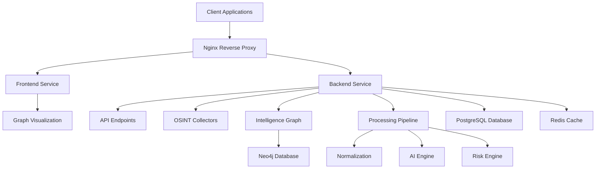

# ReconVault Architecture Documentation

## System Architecture Overview

ReconVault is designed as a modular, microservices-based cyber reconnaissance intelligence system with a focus on ethical OSINT collection and graph-based analysis.

### High-Level Architecture



## Service Components

### 1. Frontend Service

**Technology Stack:**
- React 18+
- Vite build system
- Tailwind CSS with dark cyber theme
- Framer Motion for animations
- react-force-graph for visualization
- D3.js for advanced graph rendering

**Responsibilities:**
- User interface rendering
- Graph visualization
- User interaction handling
- Real-time data display
- Responsive design

**Key Features:**
- Dark cyber theme with neon accents
- Interactive graph visualization
- Modular component structure
- Real-time updates via WebSocket
- Responsive layout for all devices

### 2. Backend Service

**Technology Stack:**
- FastAPI (Python 3.11+)
- Uvicorn ASGI server
- Pydantic for data validation
- SQLAlchemy (future)
- Neo4j Python driver (future)

**Responsibilities:**
- API endpoint management
- OSINT collection orchestration
- Data processing pipeline
- Authentication & authorization
- Request/response handling

**Key Features:**
- RESTful API design
- Modular router structure
- Async I/O operations
- Comprehensive error handling
- Health monitoring endpoints

### 3. Database Layer

#### PostgreSQL
- **Purpose:** Relational data storage
- **Use Cases:** User data, system configuration, structured intelligence
- **Volume:** `/var/lib/postgresql/data`

#### Neo4j
- **Purpose:** Graph database for intelligence relationships
- **Use Cases:** Entity relationships, network mapping, graph analytics
- **Volume:** `/data`

#### Redis
- **Purpose:** Caching and real-time processing
- **Use Cases:** Session management, rate limiting, temporary data storage
- **Volume:** `/data`

### 4. Nginx Reverse Proxy

**Configuration:**
- Reverse proxy for backend and frontend
- SSL termination (future)
- Load balancing (future)
- Request routing
- Security headers
- CORS management

**Key Features:**
- API endpoint routing (`/api/` → backend)
- Frontend static file serving
- WebSocket proxy for Vite HMR
- Security headers injection
- Gzip compression

## Data Flow

### 1. User Request Flow

```
1. User → Nginx (port 80/443)
2. Nginx → Frontend (port 5173) or Backend (port 8000)
3. Frontend → Backend API calls (via Nginx proxy)
4. Backend → Database queries (PostgreSQL/Neo4j)
5. Backend → Cache operations (Redis)
6. Backend → Response to Frontend
7. Frontend → Graph rendering
```

### 2. OSINT Collection Flow

```
1. Scheduled task → Automation Engine
2. Automation Engine → OSINT Collectors
3. Collectors → Data Normalization
4. Normalization → Intelligence Graph
5. Intelligence Graph → Neo4j Storage
6. AI Engine → Pattern Analysis
7. Risk Engine → Threat Scoring
8. Results → Frontend Visualization
```

## Technology Choices Rationale

### Why FastAPI?
- **Performance:** ASGI-based, extremely fast
- **Type Safety:** Pydantic data validation
- **Developer Experience:** Automatic OpenAPI docs
- **Async Support:** Native async/await
- **Modularity:** Easy to organize large codebases

### Why React + Vite?
- **Performance:** Vite's instant HMR and fast builds
- **Ecosystem:** Rich React component ecosystem
- **Modern Features:** ES modules, TypeScript support
- **Developer Experience:** Excellent DX with Vite
- **Visualization:** Strong D3.js integration

### Why Neo4j?
- **Graph Native:** Purpose-built for relationships
- **Cypher Query Language:** Expressive graph queries
- **Performance:** Optimized for complex traversals
- **Scalability:** Handles large, connected datasets
- **Analytics:** Built-in graph algorithms

### Why Docker?
- **Consistency:** Identical environments across systems
- **Isolation:** Service separation
- **Portability:** Easy deployment
- **Scalability:** Container orchestration ready
- **Dependency Management:** Clean dependency isolation

## Service Interactions

### Frontend ↔ Backend
- **Protocol:** HTTP/HTTPS via Nginx proxy
- **Format:** JSON API
- **Authentication:** JWT tokens (future)
- **Real-time:** WebSocket (future)

### Backend ↔ Databases
- **PostgreSQL:** SQL queries via psycopg2
- **Neo4j:** Cypher queries via Neo4j driver
- **Redis:** Key-value operations via redis-py

### Backend ↔ External Services
- **OSINT Sources:** HTTP requests with rate limiting
- **Third-party APIs:** Secure API calls
- **Webhooks:** Event-driven notifications

## Development vs Production Configuration

### Development Mode
- **Frontend:** Vite dev server with HMR
- **Backend:** Uvicorn with auto-reload
- **Databases:** Local containers with persistent volumes
- **Logging:** Verbose logging
- **CORS:** Permissive for development

### Production Mode
- **Frontend:** Vite production build (static files)
- **Backend:** Uvicorn with multiple workers
- **Databases:** Production-ready containers
- **Logging:** Structured logging with rotation
- **CORS:** Restrictive with specific origins

## Scalability Considerations

### Horizontal Scaling
- **Backend:** Multiple Uvicorn workers
- **Frontend:** Static file serving via CDN
- **Database:** Read replicas for PostgreSQL
- **Cache:** Redis cluster

### Vertical Scaling
- **Neo4j:** Memory allocation tuning
- **PostgreSQL:** Connection pool sizing
- **Redis:** Memory optimization

## Security Architecture

### Network Security
- **Nginx:** Security headers, rate limiting
- **Docker:** Isolated networks
- **API:** CORS restrictions, input validation

### Data Security
- **Encryption:** TLS for all communications
- **Authentication:** JWT with refresh tokens
- **Authorization:** Role-based access control

### Ethical Compliance
- **Rate Limiting:** Per-source rate limits
- **robots.txt:** Strict enforcement
- **Audit Logging:** Comprehensive activity logs
- **Data Retention:** Policy-based data cleanup

## Monitoring and Observability

### Logging
- **Backend:** Structured JSON logs
- **Frontend:** Browser console + error tracking
- **Nginx:** Access and error logs

### Metrics
- **Performance:** Response times, throughput
- **Errors:** Error rates, failure tracking
- **Health:** Service health checks

### Alerting
- **Critical Errors:** Immediate notifications
- **Performance:** Threshold-based alerts
- **Health:** Service degradation warnings

## Future Architecture Evolution

### Phase 2 Enhancements
- **Microservices:** Service decomposition
- **Message Queue:** RabbitMQ/Kafka for async processing
- **Search:** Elasticsearch integration
- **Authentication:** OAuth2/OIDC support

### Phase 3 Enhancements
- **Kubernetes:** Container orchestration
- **CI/CD:** Automated deployment pipelines
- **Monitoring:** Prometheus + Grafana
- **Tracing:** Distributed tracing

## Conclusion

ReconVault's architecture is designed for:
- **Modularity:** Easy to extend and maintain
- **Performance:** Optimized for large datasets
- **Security:** Built-in security best practices
- **Scalability:** Ready for growth
- **Ethics:** Compliance by design

The system provides a solid foundation for building a comprehensive cyber reconnaissance platform while maintaining flexibility for future enhancements.